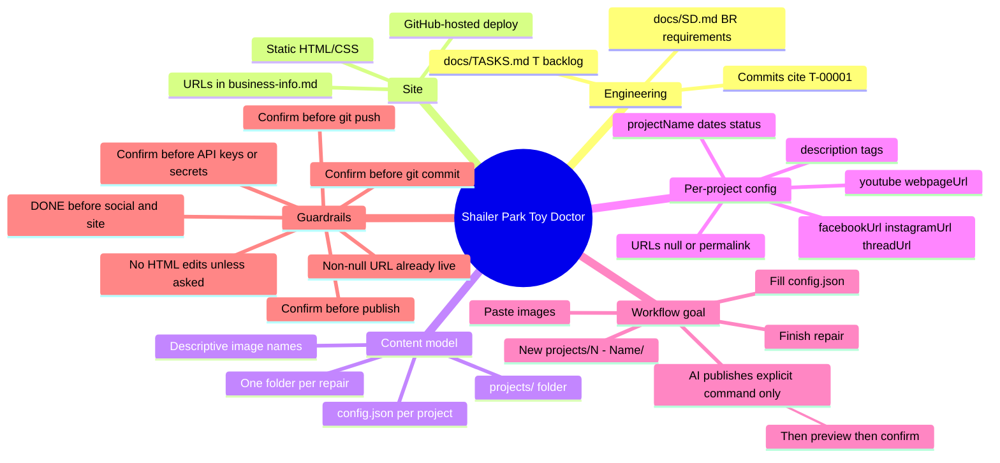

# Shailer Park Toy Doctor — project hub

Static site and publishing workflow for **Shailer Park Toy Doctor** (toy repair / restoration). Business URLs and contact details: [`docs/business-info.md`](docs/business-info.md) (e.g. **https://sptoydoctor.com.au/**).

**AI agent entry point:** start here → **[`docs/SD.md`](docs/SD.md)** (requirements) + **[`docs/TASKS.md`](docs/TASKS.md)** (backlog) → per-repair **[`projects/0000 - template/config.json`](projects/0000%20-%20template/config.json)**. Cursor rules under [`.cursor/rules/`](.cursor/rules/) cover **task-driven commits**, **human confirmation** (publish, secrets, commit, push), and **project lifecycle** (`DONE` gate, URL bookkeeping, **no `*.html` edits unless you ask for HTML work**).

---

## Mind map



---

## Repository layout (quick reference)

| Path | Role |
|------|------|
| [`docs/SD.md`](docs/SD.md) | **Specification & design** — business requirements (`BR-xxx`). |
| [`docs/business-info.md`](docs/business-info.md) | **Business facts** for copy & SEO — contact, services, channel URLs (T-00008). |
| [`docs/TASKS.md`](docs/TASKS.md) | **Task list** (`T-00001` … five-digit IDs); work and commits map here. |
| [`docs/publish-content-guards.md`](docs/publish-content-guards.md) | **Publish checks:** caption 500 chars, tags 1–30, media, validation script. |
| [`docs/github-pages-deploy.md`](docs/github-pages-deploy.md) | **Site deploy:** push `main` → GitHub Pages → sptoydoctor.com.au. |
| [`docs/website-go-live.md`](docs/website-go-live.md) | **Website go-live:** DONE repair → `index.html`, `projects-index.json`, `webpageUrl`, sitemap (T-00015). |
| [`docs/website-rebuild-analysis.md`](docs/website-rebuild-analysis.md) | **Site rebuild** analysis & direction (T-00009, discuss before HTML). |
| [`projects/0000 - template/`](projects/0000%20-%20template/) | Copy fields / structure for new repairs; [`config.json`](projects/0000%20-%20template/config.json) lists all keys. |
| `projects/<id> - <name>/` | One repair: `config.json` + images in the same folder. **Filenames are descriptive** — see [Project image filenames](#project-image-filenames). Example: [`0001 - Saielle of the Willow Tree`](projects/0001%20-%20Saielle%20of%20the%20Willow%20Tree/). |
| Site files | e.g. [`index.html`](index.html), [`css/style.css`](css/style.css), [`CNAME`](CNAME) — static site source. |

---

## Engineering: requirements → tasks → commits

1. **Requirements** live in [`docs/SD.md`](docs/SD.md) (`BR-xxx`).
2. **Work** is scheduled in [`docs/TASKS.md`](docs/TASKS.md) (`T-00001`-style IDs). Agents should align changes with an active task.
3. **Git commits** (when you approve them) should start with **`T-#####:`** (five digits after `T-`) in the subject so history traces to the task list.

---

## Project management (config + publishing)

Each repair is a folder under `projects/` with [`config.json`](projects/0000%20-%20template/config.json) (see template keys). This file is the **single source of truth** for promotion state.

### Content fields (required before publish)

| Field | Purpose |
|-------|---------|
| `title` | Headline for webpage and social (≤ **500** chars) |
| `description` | Story / caption body (≤ **500** chars for cross-platform social) |
| `itemDetails` | Optional — product/collectible facts (manufacturer, model, specs); for repair pages / SEO, not the social caption. Use **paragraph breaks** (`\n\n`); on the site, one `<p>` per paragraph (see [`docs/website-go-live.md`](docs/website-go-live.md)). Length guide from **0003 Donald Duck**: ~**375 / 294 / 330** chars per paragraph (3 paragraphs); tiers **200 / 600 / 1000** — see [`scripts/lib/item-details-budget.mjs`](scripts/lib/item-details-budget.mjs) and `node scripts/fill-project-item-details.mjs`. |
| `repairDetails` | Optional — technical repair log (symptoms, method, parts); for repair pages, not the social caption. Same paragraph rules as `itemDetails`. |
| `skills` | Repair categories — **one or more** of: `needlework`, `electronic`, `mechanical`, `paintjob` (site badges / filters). See [`docs/project-skills.md`](docs/project-skills.md) (**BR-028**). Normalize: `node scripts/normalize-project-skills.mjs`. |
| `tags` | Topic labels (**1–30**); appended as hashtags on social (see [`docs/publish-content-guards.md`](docs/publish-content-guards.md)) |
| `googleReview` | Optional — customer’s **Google review** (`quote`, `authorName` as first + last initial only e.g. `Howard C.`, optional `profileUrl`, `featuredOnTestimonials`, `featuredOrder`). See [`docs/website-testimonials-page-plan.md`](docs/website-testimonials-page-plan.md). |
| `importance` | Optional — number for **home page highlights** (`/new/` patient stories). **Higher = ranked higher** (lead story + up to six tiles). Omit or `null` = not shown there. Update with `node scripts/sync-home-highlights.mjs --set 0003=3` (see [`.cursor/rules/home-highlight-importance.mdc`](.cursor/rules/home-highlight-importance.mdc)). |
| *(privacy)* | **Do not** store other customer names, phones, or emails in `config.json`, HTML, or imports (e.g. timesheet client rows). See [`.cursor/rules/client-privacy-no-pii-in-repo.mdc`](.cursor/rules/client-privacy-no-pii-in-repo.mdc). |
| Images / video | `before`, `after`, `hero`, `WIP-###`, or video files in the project folder |

### Google reviews (paste in chat)

When you copy a review from Google Maps, paste it and say which project (e.g. **`add google review to 0003`**). The agent maps the review to a project, then runs:

`node scripts/apply-google-review.mjs <id> --author "…" --quote "…" [--profile-url …]`

That updates **`config.json`**, regens **`index.html`** when it exists, and rebuilds **`new/testimonials.html`** (with a **Repair:** link when the story page exists). Skips automatically if that review is already on the testimonials page (`--force` to override). General reviews with no project → `data/testimonials-standalone.json` + `node scripts/sync-testimonials-html.mjs`. Details: [`docs/website-testimonials-page-plan.md`](docs/website-testimonials-page-plan.md) and [`.cursor/rules/google-review-testimonial-workflow.mdc`](.cursor/rules/google-review-testimonial-workflow.mdc).

Before any publish, run: `node scripts/validate-publish.mjs <project-id>` — must exit **0**. For social (after explicit `publish …` + confirm in chat): push `main`, then `node scripts/publish-social.mjs <project-id> --use-site --wait-for-site` for Instagram/Threads (polls until all project images are live; `--image after` optional; Facebook can run without `--use-site`).

### `status` (you set this)

| Value | Meaning |
|-------|---------|
| `WIP` | Work in progress — **do not** publish to social media or ship a **public** project page for this repair. |
| `DONE` | Story ready to promote — **only** this value unlocks publishing to social and adding/showing the project on the **live website**. |

Use other labels if you like (`READY`, etc.); agents treat **only** `DONE` as cleared for public promotion. You can change `status` anytime; agents follow whatever is in the file.

### URL fields (bookkeeping + links)

All are optional until relevant. **`null` = not set yet.** A **non-null** value is the **canonical permalink** for that channel and means **already published** (or already linked) there.

| Field | When to set |
|-------|-------------|
| `facebookUrl` | After a Facebook post is live — paste the share/post URL. |
| `instagramUrl` | After an Instagram post is live. |
| `threadUrl` | After a Threads post is live. |
| `youtubeUrl` / `youtubeShortUrl` | After you **manually** upload to YouTube and have the link(s). |
| `webpageUrl` | When this repair has its **own page** on the main site (e.g. `sptoydoctor.com.au/...`) — the public URL of that page. |

**Rules for agents:**

1. If a platform field **already has a URL**, assume that channel is done unless you explicitly ask to repost or replace.
2. After an approved publish, **update** the matching field with the new link.
3. On any future **project webpage**, use these fields as **`href`s** when non-null — **do not create or edit any `*.html`** unless you explicitly ask for HTML work (e.g. `publish 0001 to webpage` after confirm, or “update `index.html` for 0001”).

### Flow (example like `0001`)

1. Create folder, images, `config.json` with `status` e.g. `WIP`.
2. When the story is ready, you set **`status` to `DONE`**.
3. With your **explicit OK**, agent (or you) publishes — then **`facebookUrl`** / **`threadUrl`** / … are filled in.
4. You upload video on YouTube → share the link → agent can **`youtubeUrl`** when you pass it.
5. When a dedicated site page exists, set **`webpageUrl`** and wire links from `config`.

See [`.cursor/rules/project-lifecycle-and-publish-guards.mdc`](.cursor/rules/project-lifecycle-and-publish-guards.mdc) for agent enforcement (`DONE` gate, no duplicate posts without consent).

---

## Project image filenames

Images sit next to each project’s `config.json`. **The filename already states the role** — agents should infer meaning from the name (no extra sidecar metadata needed).

| Convention | Examples |
|------------|----------|
| Before repair | `before.jpg`, `before.jpeg`, … |
| After / finished | `after.jpeg`, … |
| Hero / lead image (if used) | `hero.jpeg`, … |
| Work in progress | `WIP-001.jpeg`, `WIP-002.jpeg`, … (zero-padded `001`, `002`, … sequence) |

Use the same idea for new repairs: descriptive stem + optional WIP index. Extension can be `.jpg` / `.jpeg` / `.png` as exported.

**After you rename files manually** in a project folder, sync the story page only — do **not** auto-rename on disk:

```bash
node scripts/sync-project-story-images.mjs <id>
```

See [`.cursor/rules/project-images-manual-rename.mdc`](.cursor/rules/project-images-manual-rename.mdc). Use `normalize-project-media-names.mjs` only when you explicitly want capture-time auto-renaming (e.g. messy USB imports).

Before a **webpage** go-live, run `node scripts/publish-webpage.mjs <id>` (rotate if needed → optimize → validate → checklist; see [`docs/website-go-live.md`](docs/website-go-live.md)). Use `--rotate <file> --cw|--ccw|--180` or `--exif-orient` for sideways photos. If the project has **`googleReview`**, publish syncs the review onto **`index.html`** and rebuilds **`new/testimonials.html`** with a **Repair:** link (`--no-story-review` / `--no-testimonials` to skip either step).

Bulk import from a USB stick: [`docs/usb-photo-ingest.md`](docs/usb-photo-ingest.md) (`scripts/ingest-usb-photos.mjs` — dry-run first, then `--apply`, then optimize).

Repair dates from photos (EXIF): `node scripts/set-project-dates-from-images.mjs [--dry-run]` — see **T-00031** in [`docs/TASKS.md`](docs/TASKS.md).

Owner metadata worksheet (repair details + skills): `node scripts/export-project-metadata-gaps.mjs` → CSV under `docs/reports/`; attach and email manually — **T-00032**.

---

## Intended repair → publish loop

1. Create a new folder under `projects/` (same numbering / naming convention as existing entries).
2. Add photos to that folder **using the naming pattern above** (before, after, WIP sequence, etc.).
3. Author `config.json` from [`0000` template](projects/0000%20-%20template/config.json). Set `isTemplate` to `false` for real repairs. Keep `status` as `WIP` until you are ready to promote; set **`DONE`** only when social + site work may proceed per your workflow.
4. **Publishing:** Only after you give an **explicit** command like `publish 0001 to facebook`, `publish 0001 to webpage`, or `publish 0001 to social media and webpage`. The agent will show a **preview** and wait for your **confirm** before anything goes live (and only if `status` is **`DONE`**). Then update URL fields / commit / push per your approval rules.

---

## Asking the agent to publish (phrasing)

Use a clear **publish** line with project id and target, for example:

- `publish 0001 to facebook`
- `publish 0001 to webpage`
- `publish 0001 to social media and webpage` *(agent previews all social channels in scope + site if included)*

If phrasing is unclear, the agent should ask you to rephrase using this pattern — it will **not** start a publish workflow on implication alone.

---

## Cursor / AI

Project-specific behavior is defined under [`.cursor/rules/`](.cursor/rules/): **task-driven work** ([`docs/TASKS.md`](docs/TASKS.md) + [`docs/SD.md`](docs/SD.md), commits use **`T-#####`**); **explicit `publish <id> to …` → preview → your confirm**; **no `*.html` create/edit** unless you explicitly ask for HTML work (or webpage is part of an approved publish); **human confirmation** for secrets, commit, and push; **project lifecycle** (`DONE` gate, URL bookkeeping, no duplicate posts without consent).
